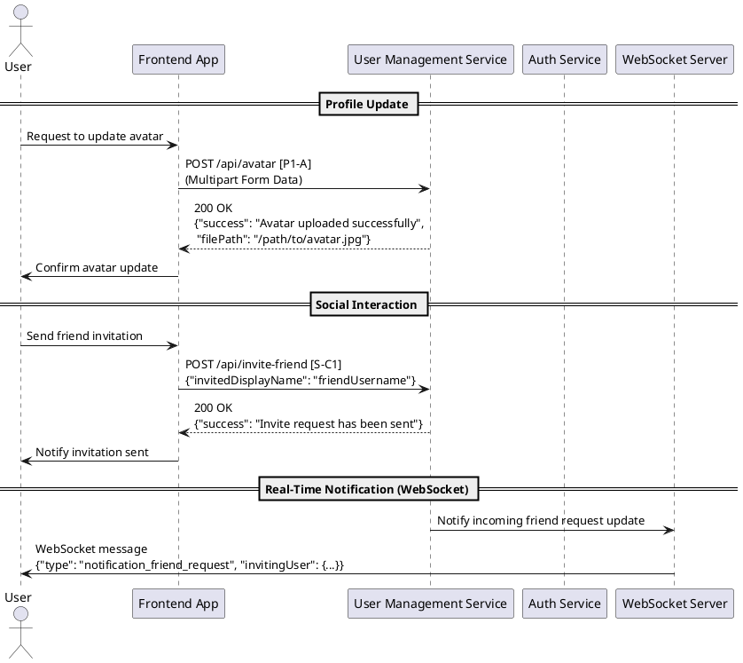

Below is one way to “improve” your endpoint list so it can be used as a basis for creating sequence diagrams. The idea is to reorganize and annotate the endpoints by flow, add unique (or shorthand) identifiers, and describe how the interactions occur. This way you or another developer can directly map the endpoints into a sequence diagram (for example using PlantUML or Mermaid). Here’s an example of how you might transform your list:

---

### 1. **Group Endpoints by Common Flows**

Instead of one long list, group endpoints by a typical user journey. For instance:  
- **Authentication Flow:** New user registration, token refresh, 2FA setup/confirmation.  
- **Profile Management:** Get profile, update display name, upload avatar.  
- **Social Interactions:** Get friend list, send/respond friend request, block/unblock users.  
- **Game/Match Flow:** Join matchmaking, cancel matchmaking, get game state, match history.  
- **Tournament Flow:** Create tournament, invite to tournament, join tournament.

*Tip:* Within every group, add a short description and a unique identifier (like A1, P1, S1, etc.) that you can refer to in your diagram.

---

### 2. **Annotate Each Endpoint with Flow Details**

For each endpoint, capture:
- **HTTP Method & URL**  
- **Handler (or service component)**  
- **Requirements (e.g., JWT authentication, multipart payload)**
- **Typical Request & Response structure**  
- **Role in the flow** (for instance, “User updates avatar” or “Retrieves match history”)

For example, for the **Upload Avatar** endpoint you might write:

- **A: Upload Avatar (P1-A)**
  - **URL:** `/api/avatar`
  - **Method:** `POST`
  - **Authentication:** JWT required
  - **Handler:** `frontendController.avatarChange`
  - **Request:** Multipart form file upload  
  - **Response:**  
    ```json
    {
      "success": "Avatar uploaded successfully",
      "filePath": "/path/to/avatar.jpg"
    }
    ```
  - **Role in Flow:** Allows the user to update their profile picture.

---

### 3. **Create Example Tables (optional)**

A table can help you see the pieces before diagramming. For example:

| **ID**  | **Flow**         | **HTTP Method** | **Endpoint**                  | **Handler**                           | **Purpose**                            |
|---------|------------------|-----------------|-------------------------------|---------------------------------------|----------------------------------------|
| Auth-A1 | New User Register| POST            | `/api/new-user`               | `authenticationController.newUser`    | Register a new user                    |
| Auth-A2 | User Token Refresh | POST          | `/api/auth/refresh`           | `authController.refreshToken`         | Issue/refresh JWT token after login    |
| P-B1    | Get Profile      | GET             | `/api/profile/:displayName`   | `frontendController.getUserProfile`   | Retrieve user profile data             |
| P-B2    | Change Display Name | POST         | `/api/display-name`           | `frontendController.displayName`      | Change the displayed username          |
| S-C1    | Invite Friend    | POST            | `/api/invite-friend`          | `frontendController.inviteFriend`     | Send friend request                    |
| S-C2    | Respond Friend Request | POST   | `/api/respond-friend`         | `frontendController.respondFriend`    | Accept or reject friend request        |
| G-D1    | Join Matchmaking | POST            | `/api/game/queue/join`        | `gameController.joinQueue`            | Enters the matchmaking queue           |

*This table lets you quickly see which identifiers (Auth-A1, P-B1, etc.) you can reference inside your sequence diagram.*

---

### 4. **Provide a Sample Sequence Diagram Using PlantUML**

Below is an example of how you might take one flow (for instance, updating a profile image and then inviting a friend) and represent it as a sequence diagram.

> **Note:** You can paste the following code into any PlantUML or Mermaid Live Editor to generate the diagram.



In this sample:
- **U** represents the user.
- **FE** (Frontend App) is the client application that makes calls.
- **UM** (User Management Service) handles most user-related operations.
- **AS** (Auth Service) is available for token refresh/2FA-related endpoints.
- **WS** (WebSocket Server) handles real-time notifications (for example, when a friend request arrives).

Each message is annotated with the corresponding endpoint identifier (e.g., [P1-A] for the Upload Avatar endpoint, [S-C1] for the Invite Friend endpoint). This makes it easier to map the interactions to your endpoint list.

---

### 5. **Additional Recommendations**

- **Consistency:** Use consistent naming conventions (e.g., prefixing endpoints with context like “/api/user/…” or “/api/auth/…”).
- **Error Scenarios:** Consider also mapping out error flows (e.g., what happens if the token is expired or the file type is invalid).
- **Microservice Boundaries:** When you have backend-only endpoints (intended for service-to-service communication), consider using different lifelines to reflect the internal architecture.
- **Versioning:** If you update your API, note versions (e.g., v1, v2) so the sequence diagram reflects the proper endpoints.
- **Diagram Tools:** While PlantUML is a popular choice, you might also consider Mermaid (which has a similar syntax) if that better fits your ecosystem.

---

This improved list and the example sequence diagram should provide a clearer, more structured view of how your endpoints interact. It’s now easier to update, maintain, and use for generating real-time sequence diagrams for debugging, documentation, or design discussions.

Is there a particular user journey or service flow you’d like to see in more detail next?